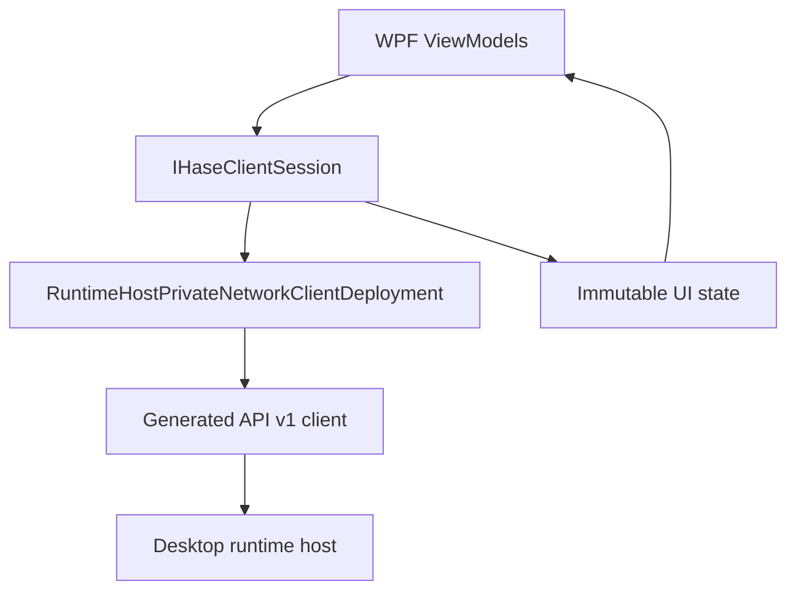
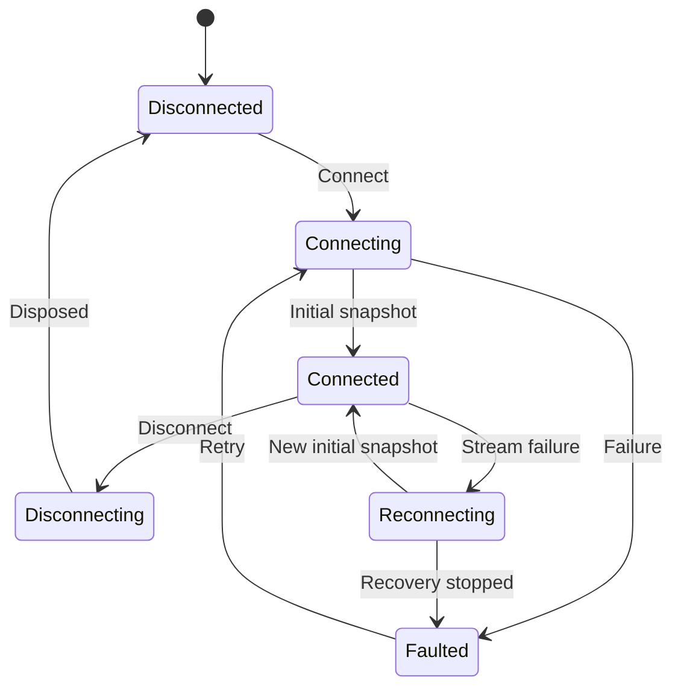

# Building a HASE Laptop Client UI

## Purpose

This tutorial describes how to build the first real HASE laptop client UI
against the validated northbound runtime-host API.

The recommended first client is a Windows 11 WPF application using .NET 10,
Prism MVVM, the generated gRPC version 1 contract, and the existing ADR-0032
private-network client composition.

The tutorial deliberately keeps the laptop operational:

- it discovers the published model through the API;
- it reads and writes Properties allowed by descriptors;
- it executes Commands explicitly;
- it displays live Property, connection, attachment, and Event observations;
- it never owns physical endpoint discovery, attachment, supervision, recovery,
  or shutdown.

Authoritative baseline:

```text
Commit 0ad8bcbd3b1e1539796f578d3e5498274984ab71
3,029 automated tests passing
API version 1.0
ADR-0032 complete
```

---

# 1. Proposed first UI scope

The initial application should contain four functional areas:

| Area | Responsibility |
| --- | --- |
| Connection | Select the external laptop configuration, connect, disconnect, and display host/API state. |
| Inventory | Display endpoints, attachment generations, instruments, Properties, Commands, and Events from descriptors. |
| Operations | Cached read, authoritative read, descriptor-valid Property write, and explicit Command execution. |
| Activity | Display connection changes, Property changes, Events, attachment publication/end, and client errors. |

The first increment should not include:

- endpoint discovery or attachment controls;
- background Command retry;
- saved operational mutations;
- remote host administration;
- credential editing;
- certificate export;
- automatic selection of a replacement attachment;
- persistent Event history.

---

# 2. Prerequisites

## 2.1 Desktop runtime host

The desktop must already:

- have the Arduino Uno connected through USB;
- reach the ESP32 through the local network;
- have the ADR-0032 desktop credentials and enrollment configuration;
- run the validated `private-network-host` scenario;
- bind only to the explicitly configured private-network address and fixed port.

## 2.2 Laptop

The laptop must already:

- be connected to the same private routed network;
- have the client certificate installed in `CurrentUser\My`;
- have the public server certificate installed in
  `CurrentUser\TrustedPeople`;
- have the external `laptop-private-network.json`;
- have successfully run the validated `private-network-client` scenario.

Do not copy deployment values into the UI project.

## 2.3 Development baseline

Use:

- Windows 11;
- Visual Studio;
- .NET 10 SDK;
- the HASE repository at or after the ADR-0032 baseline.

---

# 3. Project placement and references

Add the UI project to the HASE solution so it can consume the current
source-controlled contract without publishing internal packages first.

Suggested project:

```text
src/Hase.Client.Wpf
```

Suggested tests:

```text
tests/Hase.Client.Wpf.Tests
```

The UI project needs project references to:

```text
src/Hase.Runtime.Remote.Grpc.Contracts
src/Hase.Runtime.Remote.Grpc.Hosting
```

The contract project provides:

- protobuf messages;
- generated gRPC client;
- API version 1 namespace.

The hosting project provides:

- external client configuration loading;
- certificate-store lookup;
- mutual-TLS channel creation;
- exact server-certificate pinning;
- client deployment lifetime ownership.

Do not duplicate the TLS handler or certificate loading in the UI.

---

# 4. Recommended client architecture

Use one application-scoped client session service behind the ViewModels:



Suggested application types:

```text
IHaseClientSession
HaseClientSession
ClientConnectionState
RuntimeHostModel
EndpointAttachmentModel
InstrumentModel
PropertyModel
CommandModel
EventModel
ActivityEntry
```

The session service should own:

- exactly one active client deployment;
- exactly one observation call;
- one connected-session cancellation source;
- the last observation sequence;
- the current immutable or carefully synchronized client model.

ViewModels should not hold generated gRPC call objects.

---

# 5. Session state machine

Use explicit UI connection states:



Recommended meaning:

| State | UI behavior |
| --- | --- |
| `Disconnected` | Configuration can be selected; operational controls disabled. |
| `Connecting` | Connect disabled; cancellation enabled; show progress. |
| `Connected` | Operations enabled according to descriptors and endpoint state. |
| `Reconnecting` | Existing state may be shown as stale; mutations disabled. |
| `Disconnecting` | All new operations disabled. |
| `Faulted` | Show safe error summary and allow deliberate reconnect. |

The runtime endpoint connection states from the API are separate from the
laptop application's session state.

---

# 6. Load the external configuration

The UI should receive a fully qualified path chosen by the operator. It should
not display the file contents.

```csharp
using Hase.Runtime.Remote.Grpc.Hosting;

RuntimeHostPrivateNetworkClientOptions options =
    await RuntimeHostPrivateNetworkClientOptionsFile.LoadAsync(
        configurationFilePath,
        cancellationToken);
```

`LoadAsync` validates:

- the versioned JSON format;
- the explicit HTTPS IP address;
- the absence of URI path, query, fragment, or user information;
- exact certificate-store enum names;
- certificate thumbprint shape;
- the 64 KiB document limit;
- absence of unknown fields.

Display a generic configuration error to the user. Do not echo the address,
thumbprints, or full path into ordinary UI activity logs.

---

# 7. Create and own the connected deployment

```csharp
RuntimeHostPrivateNetworkClientDeployment deployment =
    RuntimeHostPrivateNetworkClientDeployment.Create(options);

RuntimeHostRemoteApi.RuntimeHostRemoteApiClient client =
    deployment.Client.Client;
```

The deployment owns the gRPC channel, HTTP handler, and loaded certificates.
Keep it for the entire connected session.

Dispose it during:

- explicit disconnect;
- failed connection cleanup;
- application shutdown.

Never create a new deployment for every button click.

---

# 8. Start with observation, not a separate snapshot call

For the connected UI, open `Observe` immediately. Its first response contains
the coherent initial snapshot and sequence.

```csharp
using Grpc.Core;
using GrpcV1 = Hase.Runtime.Remote.Grpc.V1;

AsyncServerStreamingCall<GrpcV1.ObserveResponse> observationCall =
    client.Observe(
        new GrpcV1.ObserveRequest(),
        cancellationToken: sessionCancellationToken);
```

Read the first message:

```csharp
if (!await observationCall.ResponseStream.MoveNext(
        sessionCancellationToken))
{
    throw new InvalidDataException(
        "The observation stream ended before its initial snapshot.");
}

GrpcV1.ObserveResponse first =
    observationCall.ResponseStream.Current;

if (first.ContentCase
    != GrpcV1.ObserveResponse.ContentOneofCase.InitialSnapshot)
{
    throw new InvalidDataException(
        "The first observation response is not an initial snapshot.");
}

GrpcV1.GetSnapshotResponse snapshot =
    first.InitialSnapshot.Snapshot;

ulong lastSequence =
    first.InitialSnapshot.SnapshotSequence;
```

Validate API compatibility before enabling controls:

```csharp
if (snapshot.ApiVersion.Major != 1)
{
    throw new NotSupportedException(
        $"Runtime-host API major version "
        + $"{snapshot.ApiVersion.Major} is not supported.");
}
```

Display only non-sensitive connection facts:

- connected/disconnected state;
- runtime-host ID;
- API version;
- endpoint count.

---

# 9. Build the descriptor-driven UI model

For every `PublishedRuntimeEndpointSnapshot`:

1. preserve `EndpointId`;
2. preserve `AttachmentGeneration`;
3. preserve `ConnectionStatus`;
4. traverse `Descriptor_.Instruments`;
5. create Property, Command, and Event presentation models.

Example:

```csharp
foreach (GrpcV1.PublishedRuntimeEndpointSnapshot endpoint
    in snapshot.Endpoints)
{
    GrpcV1.EndpointDescriptor descriptor =
        endpoint.Descriptor_
        ?? throw new InvalidDataException(
            "A published endpoint has no descriptor.");

    foreach (GrpcV1.InstrumentDescriptor instrument
        in descriptor.Instruments)
    {
        foreach (GrpcV1.PropertyDescriptor property
            in instrument.Properties)
        {
            // Create a UI Property model carrying all four target fields.
        }

        foreach (GrpcV1.CommandDescriptor command
            in instrument.Commands)
        {
            // Preserve the complete ordered command path.
        }

        foreach (GrpcV1.EventDescriptor eventDescriptor
            in instrument.Events)
        {
            // Preserve the complete ordered event path.
        }
    }
}
```

Do not identify anything by display name. Display names may be duplicated or
localized later.

Recommended attachment key:

```csharp
public readonly record struct AttachmentKey(
    string EndpointId,
    string AttachmentGeneration);
```

Recommended Property key:

```csharp
public readonly record struct PropertyKey(
    AttachmentKey Attachment,
    string InstrumentId,
    string PropertyId);
```

---

# 10. Enable controls from descriptors

Property controls must follow `PropertyAccessMode`.

```csharp
bool canRead =
    property.AccessMode
        is GrpcV1.PropertyAccessMode.Read
        or GrpcV1.PropertyAccessMode.ReadWrite;

bool canWrite =
    property.AccessMode
        is GrpcV1.PropertyAccessMode.Write
        or GrpcV1.PropertyAccessMode.ReadWrite;
```

Also require the current endpoint connection state to be `Ready` for active
operations.

Cached reads may remain useful when the endpoint is disconnected, but their
connection status and value quality must be shown.

For numeric editors:

- show quantity and native unit;
- enforce advertised minimum and maximum;
- preserve numeric input as `double` on the remote contract;
- treat resolution as data resolution, not automatically as UI step size.

For Boolean Properties, use an explicit editor such as a checkbox or two-state
selector.

For strings, validate locally only against constraints actually present in the
descriptor. Version 1 currently carries no string-length descriptor.

---

# 11. Create generation-scoped targets

Property target:

```csharp
static GrpcV1.PropertyTarget CreatePropertyTarget(
    GrpcV1.PublishedRuntimeEndpointSnapshot endpoint,
    GrpcV1.InstrumentDescriptor instrument,
    GrpcV1.PropertyDescriptor property)
{
    return new GrpcV1.PropertyTarget
    {
        EndpointId = endpoint.EndpointId,
        AttachmentGeneration = endpoint.AttachmentGeneration,
        InstrumentId = instrument.InstrumentId,
        PropertyId = property.PropertyId
    };
}
```

Command target:

```csharp
static GrpcV1.CommandTarget CreateCommandTarget(
    GrpcV1.PublishedRuntimeEndpointSnapshot endpoint,
    GrpcV1.InstrumentDescriptor instrument,
    GrpcV1.CommandDescriptor command)
{
    var target =
        new GrpcV1.CommandTarget
        {
            EndpointId = endpoint.EndpointId,
            AttachmentGeneration = endpoint.AttachmentGeneration,
            InstrumentId = instrument.InstrumentId
        };

    target.CommandPathSegments.AddRange(
        command.PathSegments);

    return target;
}
```

Never rebuild a target from only the endpoint ID after reconnection. A new
attachment generation requires a new explicit UI selection or reconciliation.

---

# 12. Read cached Property state

```csharp
GrpcV1.CachedPropertyResult result =
    await client.ReadCachedPropertyAsync(
        new GrpcV1.ReadCachedPropertyRequest
        {
            Target = target
        },
        deadline: DateTime.UtcNow.AddSeconds(5),
        cancellationToken: cancellationToken);
```

Then:

```csharp
if (result.Status == GrpcV1.PropertyOperationStatus.Success
    && result.Snapshot?.CurrentValue is not null)
{
    ApplyPropertyValue(
        result.Snapshot.CurrentValue);
}
else
{
    HandlePropertyStatus(
        result.Status,
        result.HasDiagnostic ? result.Diagnostic : null);
}
```

Use cached reads for quick display refreshes. Do not label a cached value as an
authoritative endpoint read.

---

# 13. Read a Property authoritatively

```csharp
GrpcV1.PropertyOperationResult result =
    await client.ReadAuthoritativePropertyAsync(
        new GrpcV1.ReadAuthoritativePropertyRequest
        {
            Target = target
        },
        deadline: DateTime.UtcNow.AddSeconds(10),
        cancellationToken: cancellationToken);
```

Only consume `ConfirmedValue` when:

```csharp
result.Status == GrpcV1.PropertyOperationStatus.Success
```

Use the confirmed UTC timestamp and quality in the UI.

---

# 14. Write a Property

Map the editor value to the closed remote union:

```csharp
static GrpcV1.RemoteValue FromBoolean(bool value) =>
    new()
    {
        BooleanValue = value
    };

static GrpcV1.RemoteValue FromString(string value) =>
    new()
    {
        StringValue = value
    };

static GrpcV1.RemoteValue FromNumber(double value) =>
    new()
    {
        NumericValue = value
    };
```

Execute:

```csharp
GrpcV1.PropertyOperationResult result =
    await client.WritePropertyAsync(
        new GrpcV1.WritePropertyRequest
        {
            Target = target,
            RequestedValue = requestedValue
        },
        deadline: DateTime.UtcNow.AddSeconds(10),
        cancellationToken: cancellationToken);
```

UI rules:

1. disable the individual write control while the request is active;
2. do not permanently apply an optimistic value;
3. inspect `result.Status`;
4. on success, apply `result.ConfirmedValue`;
5. on timeout or transport failure, mark the outcome uncertain;
6. perform an authoritative read before offering another mutation;
7. never automatically retry.

---

# 15. Execute a Command

For a parameterless Command:

```csharp
GrpcV1.CommandOperationResult result =
    await client.ExecuteCommandAsync(
        new GrpcV1.ExecuteCommandRequest
        {
            Target = commandTarget
        },
        deadline: DateTime.UtcNow.AddSeconds(10),
        cancellationToken: cancellationToken);
```

For an argument-bearing Command, set `Argument` to the appropriate
`RemoteValue`.

Execution must require an explicit user action. Disable the selected Command
while its request is active.

On `Success`, show completion and consume an optional return value. When a
Command affects a known Property, perform an authoritative Property read to
confirm state.

On timeout, cancellation after transmission, or transport loss, the outcome may
be uncertain. Do not retry automatically.

---

# 16. Consume live observations

After the initial snapshot, continue reading on a background task:

```csharp
while (await observationCall.ResponseStream.MoveNext(
        sessionCancellationToken))
{
    GrpcV1.ObserveResponse response =
        observationCall.ResponseStream.Current;

    if (response.ContentCase
        != GrpcV1.ObserveResponse.ContentOneofCase.Observation)
    {
        throw new InvalidDataException(
            "The stream published a second initial snapshot.");
    }

    GrpcV1.RuntimeHostObservation observation =
        response.Observation;

    if (observation.Sequence <= lastSequence)
    {
        throw new InvalidDataException(
            "Observation sequence is not strictly increasing.");
    }

    lastSequence = observation.Sequence;

    await PublishToUiAsync(
        observation,
        sessionCancellationToken);
}
```

Dispatch model changes onto the WPF dispatcher or into a serialized state
reducer. Never mutate `ObservableCollection<T>` from the gRPC reader thread.

Handle payloads by `Kind` and matching oneof case.

## 16.1 Attachment published

- add the exact endpoint/generation attachment;
- build its complete descriptor-driven child model;
- do not silently replace a currently selected older generation.

## 16.2 Attachment ended

- mark or remove only the matching endpoint/generation;
- cancel or invalidate editors targeting that generation;
- retain an activity entry with `EndedAtUtc`.

## 16.3 Connection status changed

- update the matching attachment;
- enable active operations only when appropriate;
- keep cached values visible with their timestamps and quality.

## 16.4 Property value changed

- match endpoint ID;
- match attachment generation;
- match instrument ID;
- match Property ID;
- apply the current value;
- optionally retain the previous value in the activity entry.

## 16.5 Event occurred

- match endpoint ID and generation;
- match instrument ID and full ordered Event path;
- display UTC occurrence time;
- inspect the optional value union;
- do not treat the Event as replayable or persistent.

---

# 17. Convert remote values for display

```csharp
static object? ToDisplayValue(GrpcV1.RemoteValue? value)
{
    if (value is null)
    {
        return null;
    }

    return value.KindCase switch
    {
        GrpcV1.RemoteValue.KindOneofCase.BooleanValue =>
            value.BooleanValue,

        GrpcV1.RemoteValue.KindOneofCase.StringValue =>
            value.StringValue,

        GrpcV1.RemoteValue.KindOneofCase.NumericValue =>
            value.NumericValue,

        GrpcV1.RemoteValue.KindOneofCase.None =>
            null,

        _ =>
            throw new InvalidDataException(
                "Unsupported remote value kind.")
    };
}
```

Format numeric values using the unit from the Property descriptor. Keep the
stored client model numeric value independent of localized display formatting.

---

# 18. Handle operation statuses centrally

Use one mapping from each stable status enum to UI behavior.

Property examples:

| Status | UI behavior |
| --- | --- |
| `AttachmentNotCurrent` | Mark selection stale and reconcile inventory. |
| `InvalidValue` | Keep the editor open and show validation feedback. |
| `EndpointUnavailable` | Show current connection state; disable mutation. |
| `TimedOut` | Mark outcome uncertain and offer authoritative refresh. |

Command examples:

| Status | UI behavior |
| --- | --- |
| `AttachmentNotCurrent` | Mark selection stale; never retarget automatically. |
| `ArgumentNotSupported` | Return focus to argument editor. |
| `EndpointUnavailable` | Show connection state. |
| `TimedOut` | Mark outcome uncertain; never retry automatically. |

Diagnostics may be displayed in a technical-detail expander, but program logic
must use the enum.

---

# 19. Handle gRPC failures centrally

```csharp
try
{
    // RPC
}
catch (RpcException exception)
{
    switch (exception.StatusCode)
    {
        case StatusCode.Cancelled:
            // Expected during an explicit disconnect when our token was cancelled.
            break;

        case StatusCode.DeadlineExceeded:
            // Show timeout; mutation outcome may be uncertain.
            break;

        case StatusCode.PermissionDenied:
            // Authenticated principal lacks this operation permission.
            break;

        case StatusCode.Unauthenticated:
            // Certificate authentication/session establishment failed.
            break;

        case StatusCode.Unavailable:
            // Host or transport unavailable.
            break;

        case StatusCode.DataLoss:
            // Observation gap: discard subscription sequence and reopen.
            break;

        default:
            // Show a safe failure summary and log no secrets.
            break;
    }
}
```

For the observation stream:

- `Cancelled` is normal after explicit local cancellation;
- `DataLoss` requires a completely new subscription and initial snapshot;
- `Unavailable` may enter the UI `Reconnecting` state;
- reconnection must never replay or automatically repeat mutations.

---

# 20. Reconnection strategy

The first UI should use conservative, explicit recovery:

1. stop accepting new operations;
2. cancel and dispose the failed observation call;
3. preserve the visible model as stale;
4. wait according to a bounded client reconnect schedule;
5. create a new connected session when necessary;
6. open a new observation subscription;
7. replace/reconcile state from its initial snapshot;
8. require explicit user confirmation before any further mutation.

Do not assume attachment generations survive runtime-host restart or endpoint
reattachment.

Do not queue Commands or writes while disconnected.

---

# 21. Disconnect and application shutdown

Recommended order:

1. set session state to `Disconnecting`;
2. disable new UI operations;
3. cancel the session cancellation source;
4. await the observation reader task;
5. dispose the streaming call;
6. dispose the client deployment;
7. dispose the cancellation source;
8. clear sensitive in-memory configuration objects where practical;
9. set state to `Disconnected`.

Cancellation during an active mutation must not be reported as proof that the
endpoint did not act. Offer an authoritative refresh after reconnect.

---

# 22. MVVM command rules

Recommended UI commands:

```text
ConnectCommand
DisconnectCommand
ReadCachedPropertyCommand
ReadAuthoritativePropertyCommand
WritePropertyCommand
ExecuteCommandCommand
ClearActivityCommand
```

`CanExecute` should consider:

- client session state;
- selected attachment generation;
- endpoint connection state;
- Property access mode;
- whether the selected operation is already active;
- whether input validates against the descriptor.

Every async command must observe cancellation and surface failures through
ViewModel state rather than an unobserved task.

---

# 23. Suggested first screen

```text
Connection bar
  Configuration file | Connect | Disconnect | Host ID | API 1.0

Left pane
  Endpoint attachment
    Instrument
      Properties
      Commands
      Events

Center pane
  Selected member descriptor
  Current value / quality / timestamp
  Cached Read | Authoritative Read | Write
  Command argument | Execute

Bottom pane
  UTC activity stream
  Connection changes
  Property changes
  Events
  Operation outcomes
```

The activity pane should omit:

- private-network address;
- certificate thumbprints;
- certificate contents;
- configuration paths;
- client credential identifiers;
- passwords and private keys.

---

# 24. Test strategy

## 24.1 Unit tests

Test without a physical endpoint:

- descriptor-to-UI-model projection;
- attachment and Property keys;
- value union conversion;
- Property access-mode enablement;
- operation-status presentation;
- observation sequence enforcement;
- observation reducer for all five kinds;
- stale-generation behavior;
- dispatcher-independent state reduction;
- disconnect cleanup;
- redaction of deployment values from activity messages.

## 24.2 Client service tests

Introduce an application-owned abstraction around the generated client so
ViewModels can be tested deterministically.

Test:

- first stream message must be an initial snapshot;
- second initial snapshot is rejected;
- non-increasing sequence is rejected;
- `DataLoss` causes resubscription rather than replay;
- mutations are never automatically retried;
- disconnect cancels the stream;
- disposal happens exactly once.

## 24.3 Integration tests

Use the existing in-process/loopback host composition for:

- snapshot projection;
- cached and authoritative reads;
- writes;
- Commands;
- observation initialization and updates;
- authorization failures;
- deadlines and cancellation.

## 24.4 Physical acceptance test

On the validated two-computer topology:

1. start the desktop host with ESP32 and Arduino attached;
2. connect the laptop UI;
3. verify two published endpoint attachments;
4. read ESP32 temperature authoritatively;
5. read Arduino LED state authoritatively;
6. execute `Led.Toggle` explicitly;
7. confirm the changed state authoritatively;
8. observe the Property change;
9. restore the original LED state;
10. press the physical validation button;
11. observe the Event with UTC timestamp;
12. disconnect the UI;
13. stop the host orderly.

---

# 25. Recommended implementation increments

Keep each increment buildable and testable.

## Increment 1 — Client shell and session foundation

- add WPF/Prism project;
- add project references;
- load external configuration;
- create/dispose deployment;
- open observation;
- display host ID, API version, and connection state;
- unit-test connection state transitions.

## Increment 2 — Descriptor-driven inventory

- project initial snapshot;
- display endpoint/instrument/member tree;
- key by endpoint plus generation;
- unit-test descriptor mapping.

## Increment 3 — Read-only Property UI

- cached read;
- authoritative read;
- value, quality, timestamp, and unit display;
- status handling;
- no mutation yet.

## Increment 4 — Live observation

- consume all observation kinds;
- enforce sequences;
- marshal model updates to UI;
- handle `DataLoss` through a new subscription.

## Increment 5 — Property write

- descriptor-driven Boolean/string/numeric editors;
- range validation;
- confirmed-value handling;
- uncertain-outcome handling;
- no automatic retry.

## Increment 6 — Command execution

- explicit Command UI;
- optional argument editor;
- exactly-once client behavior;
- authoritative state confirmation where applicable.

## Increment 7 — Physical laptop validation and documentation

- execute the complete two-computer acceptance test;
- record a new capability baseline;
- update project status and roadmap.

---

# 26. Definition of done for the first client

The first real laptop UI is complete when:

- it connects through the existing ADR-0032 certificate-store-backed client;
- it reveals no deployment secrets in source or ordinary UI output;
- it builds its inventory entirely from the version 1 snapshot descriptors;
- it preserves endpoint identity and attachment generation separately;
- it performs cached and authoritative reads;
- it writes only descriptor-writable Properties;
- it executes Commands only by explicit user action;
- it never automatically retries a mutation;
- it consumes all five observation kinds;
- it enforces subscription-local sequence ordering;
- it safely handles stream cancellation and gaps;
- it disconnects and disposes all owned resources orderly;
- automated tests cover the client state model;
- the physical desktop-to-laptop scenario passes for ESP32 and Arduino.

